# :trophy: A.3.3 Actividad de aprendizaje

Circuito de medición de temperatura a través de un NodeMCU ESP32
___

## Instrucciones

- Basado en la figura 1, ensamblar un sistema, capaz de detectar la temperatura y humedad del ambiente, a través de un circuito electrónico, utilizando un NodeMCU **ESP32**, y un **Sensor DHT11/DHT22**.
- Toda actividad o reto se deberá realizar utilizando el estilo **MarkDown con extension .md** y el entorno de desarrollo VSCode, debiendo ser elaborado como un documento **single page**, es decir si el documento cuanta con imágenes, enlaces o cualquier documento externo debe ser accedido desde etiquetas y enlaces, y debe ser nombrado con la nomenclatura **A3.3_NombreApellido_Equipo.pdf.**
- Es requisito que el .md contenga una etiqueta del enlace al repositorio de su documento en GITHUB, por ejemplo **Enlace a mi GitHub** y al concluir el reto se deberá subir a github.
- Desde el archivo **.md** exporte un archivo **.pdf** que deberá subirse a classroom dentro de su apartado correspondiente, sirviendo como evidencia de su entrega, ya que siendo la plataforma **oficial** aquí se recibirá la calificación de su actividad.
- Considerando que el archivo .PDF, el cual fue obtenido desde archivo .MD, ambos deben ser idénticos.
- Su repositorio ademas de que debe contar con un archivo **readme**.md dentro de su directorio raíz, con la información como datos del estudiante, equipo de trabajo, materia, carrera, datos del asesor, e incluso logotipo o imágenes, debe tener un apartado de contenidos o indice, los cuales realmente son ligas o **enlaces a sus documentos .md**, _evite utilizar texto_ para indicar enlaces internos o externo.
- Se propone una estructura tal como esta indicada abajo, sin embargo puede utilizarse cualquier otra que le apoye para organizar su repositorio.
  
```
- readme.md
  - blog
    - C3.1_TituloActividad.md
    - C3.2_TituloActividad.md
    - C3.3_TituloActividad.md
    - C3.4_TituloActividad.md
    - C3.5_TituloActividad.md
    - C3.6_TituloActividad.md
    - C3.7_TituloActividad.md
    - C3.8_TituloActividad.md
  - IMG
  - docs
    - A3.1_TituloActividad.md
    - A3.2_TituloActividad.md
    - A3.3_TituloActividad.md
```

### Fuentes de apoyo para desarrollar la actividad:

   - [x] [Random Nerd Tutorial Touch pin](https://randomnerdtutorials.com/esp32-touch-pins-arduino-ide/)

   - [x] [Ejemplo de circuito con LED RGB Led](https://i0.wp.com/saber.patagoniatec.com/wp-content/uploads/2019/07/led-rgb-catodo-anado-comun.jpg)

___

## Desarrollo

1.Utilice el siguiente listado de materiales para la elaboración de la actividad

| Cantidad | Descripción                                                                                                                                                                                                                           |
| -------- | ------------------------------------------------------------------------------------------------------------------------------------------------------------------------------------------------------------------------------------- |
| 1        | [Sensor temperatura y humedad DHT11](https://articulo.mercadolibre.com.mx/MLM-664315278-sensor-de-temperatura-y-humedad-dht11-cjumpers-arduino-pic-_JM#position=1&type=item&tracking_id=b203e8cd-c375-429a-9b75-8c57e8b35386) o DHT22 |
| 1        | [Diodo led RGB](https://saber.patagoniatec.com/2019/07/como-funciona-un-led-rgb/)                                                                                                                                                                                                                         |
| 1        | [Resistencia 4.7 kohms](https://www.electronicaplugandplay.com/componentes-pasivos/resistencias/resistencias-de-carbon/product/92-resistencia-4-7-k-1-4-watt)                                                                                                                                                                                                                 |
| 3        | [Resistencias 1 kohm](https://www.electrocomponentes.es/resistencias/resistencia-1k-ohm-025w-39-.html)                                                                                                                                                                                                                   |
| 1        | [Fuente de voltaje de  5V](https://www.amazon.com.mx/AC-DC-fuente-alimentaci%C3%B3n-Black/dp/B078RXZM4C/ref=asc_df_B078RXZM4C/?tag=gledskshopmx-20&linkCode=df0&hvadid=450926494212&hvpos=&hvnetw=g&hvrand=1295224076675663008&hvpone=&hvptwo=&hvqmt=&hvdev=c&hvdvcmdl=&hvlocint=&hvlocphy=9073855&hvtargid=pla-436418104506&psc=1)                                                                                                                                                                                |
| 1        | [NodeMCU ESP32](https://articulo.mercadolibre.com.mx/MLM-587686290-esp32-wifi-bluetooth-42-ble-nodemcu-esp8266-libro-gratis-_JM#position=1&type=item&tracking_id=84a6234b-5016-47eb-9950-39b49846ca72)                                |
| 1        | [BreadBoard](https://www.amazon.com.mx/Deke-Home-Breadboard-distribuci%C3%B3n-electr%C3%B3nica/dp/B086C9HK7V/ref=sr_1_22?__mk_es_MX=%C3%85M%C3%85%C5%BD%C3%95%C3%91&dchild=1&keywords=breadboard&qid=1599003455&sr=8-22)                                                                                                                                                                                                                     |
| 1        | [Jumpers M/M](https://www.amazon.com.mx/ELEGOO-Macho-Hembra-Macho-Macho-Hembra-Hembra-Protoboard/dp/B06ZXSQ5WG/ref=sr_1_1?__mk_es_MX=%C3%85M%C3%85%C5%BD%C3%95%C3%91&dchild=1&keywords=jumper+wires&qid=1599003519&sr=8-1)                                                                                                                                                                                                          |
       

2. Basado en las imágenes que se muestran en la **Figuras 1**, ensamble el circuito en un solo circuito electrónico, ide tal manera que se pueda obtener un sistema capaz de cumplir con las instrucciones antes solicitadas para esta actividad.
 

<p align="center"> 
    <strong>Figura 1 Circuito ESP32 y Sensor DHT</strong>
    
</p>

1.  Una vez ensamblado el circuito anterior, agregue un LED RGB y elabore el programa que le permita al LED RGB funcionar como indicador para las siguientes condiciones:
    - El sensor de temperatura en todo momento estará sensando, enviando el valor registrado por la terminal serial, por ejemplo "Temperatura ambiente: 25 grados" y el **LED RGB** estará encendido de color verde.
    - El sensor de temperatura al registrar un valor del ~20% por arriba de la temperatura ambiental, deberá mostrar el mensaje "Temperatura alta: ? grados" y el **LED RGB** se encenderá de color rojo.
    - El sensor de temperatura al registra un valor del ~20% por abajo de la temperatura ambiental, deberá mostrar el mensaje "Temperatura baja: ? grados" y el **LED RGB** se encenderá de color azul.
2. Coloque aquí evidencias que considere importantes durante el desarrollo de la actividad.
- Evidencia fisica realizada por Jose Alfredo Venegas Medina
- [Presentacion del circuito (VIDEO)](https://youtu.be/RufUnaXiud0) 

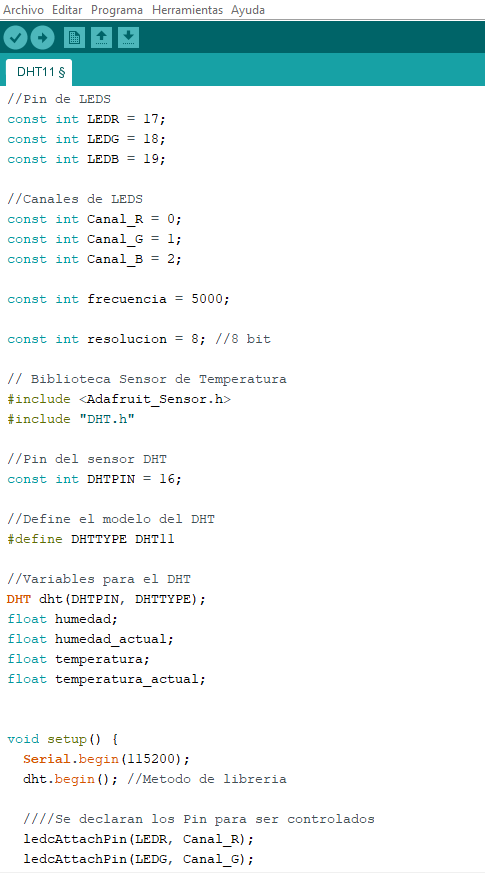


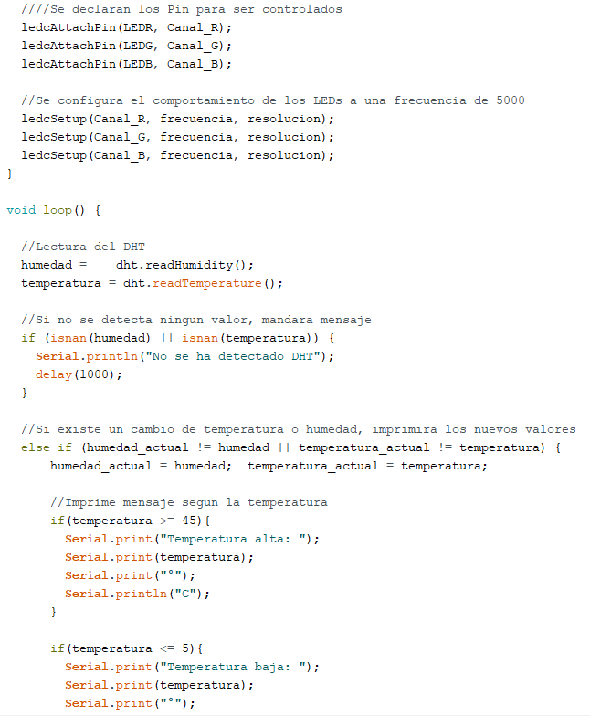


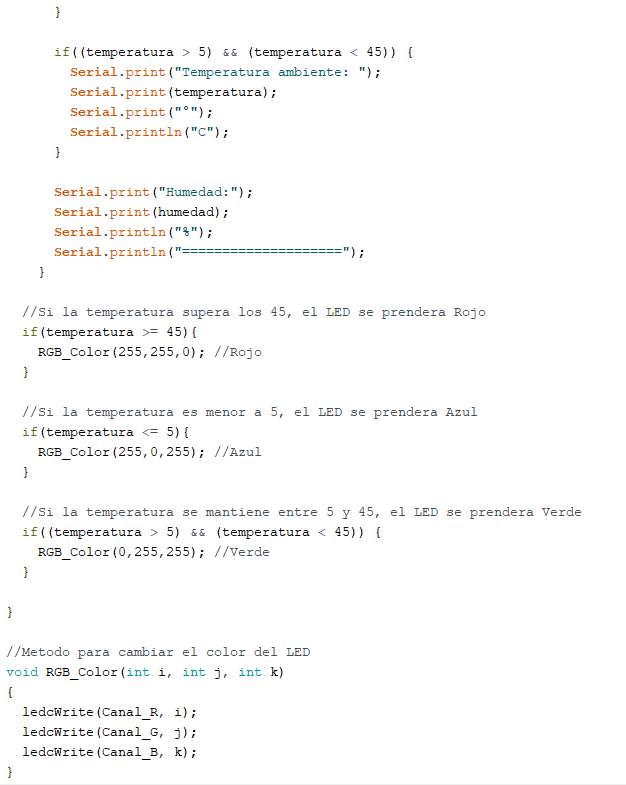

**Temperatura Ambiente (Aprox. 25 grados C):**
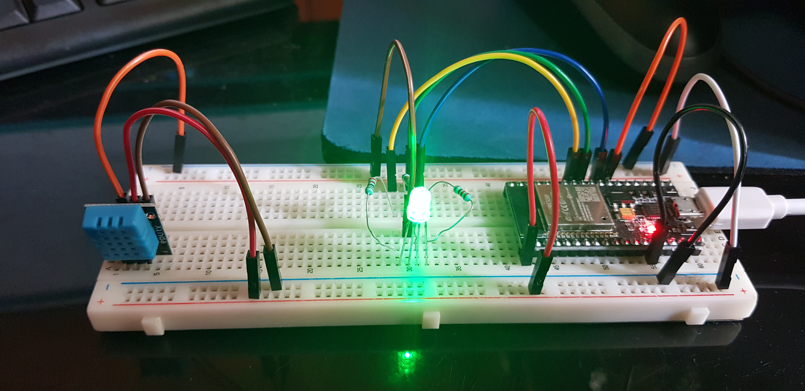

**Temperatura Baja (Menor a 5 grados C):**
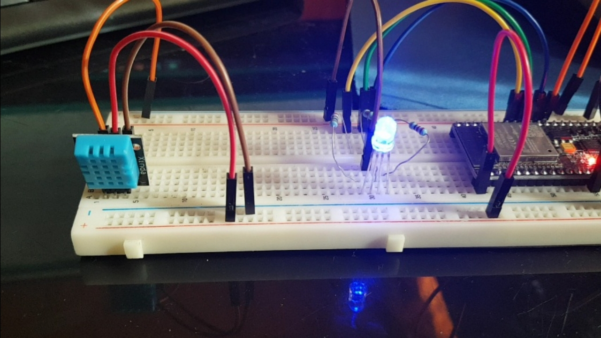

**Temperatura Alta (Mayor a 45 grados C):**
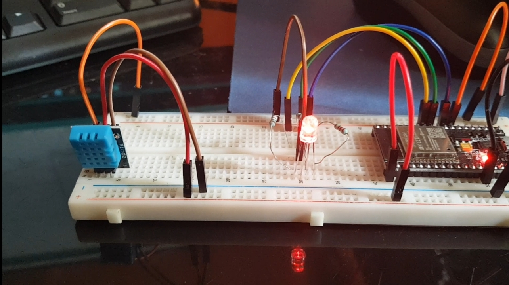

1. Evidencias reuniones.
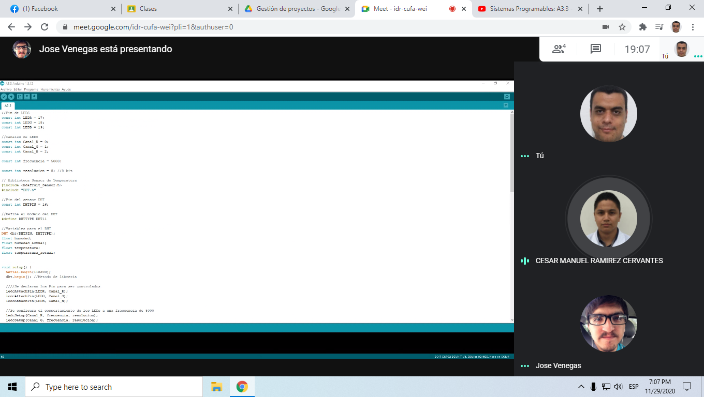
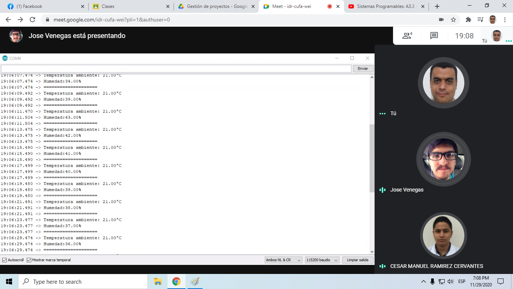
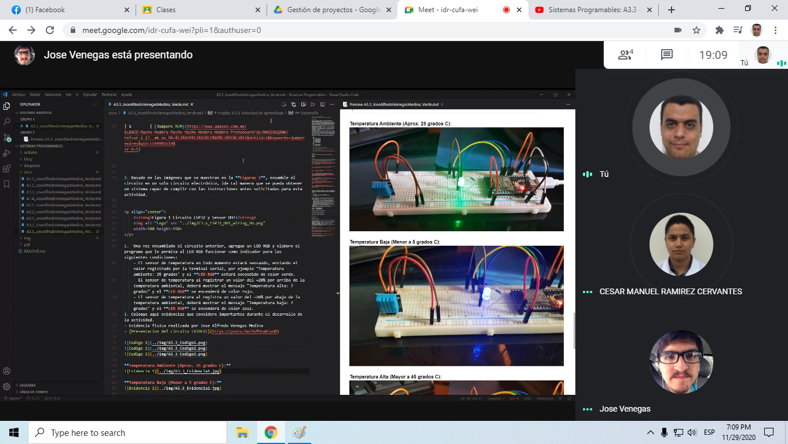
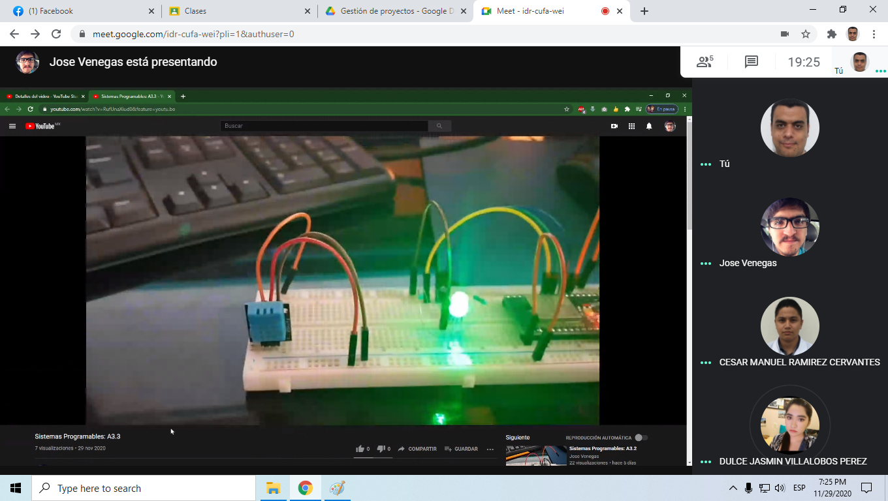
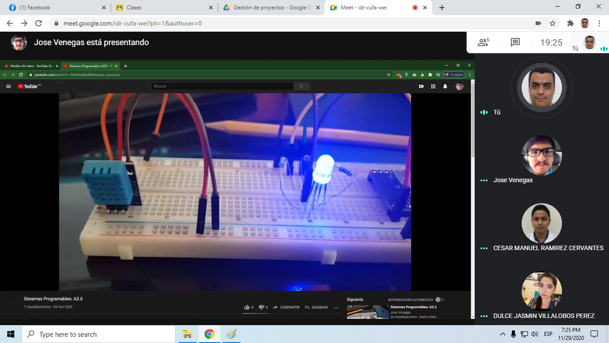

4. Conclusiones:
- **Acevedo Ensiso Pedro Gabriel:**  
La utilización de un sensor de temperatura es muy útil para diversas aplicaciones en la industria, con esta práctica compruebo que lo que hay detrás de un sistema detector de temperatura más que nada es la escalación apropiada de los valores medidos a valores que sean concretos para nuestros objetivos, mediante el uso de código podemos traducir las mediciones a temperaturas con las cuales al ser detectadas nos indiquen una función a realizar, en este caso fue el simple uso de un LED RGB con el cual mostramos que temperatura se a detectado. Pero un sistema de este tipo fácilmente puede ser utilizado en sistemas de enfriamiento, control de temperatura e incluso en componentes digitales. 

- **Ramirez Cervantes Cesar Manuel:**  
Gracias a los circuitos que nos ayudan a detectar la temperatura podemos hacer muchas aplicaciones en el área de automatización con esto podemos controlar la temperatura de un refrigerador, también podemos usar un circuito como este en sistemas de aviso de emergencia dentro de lugares peligrosos, como las plantas de energía eléctrica o nuclear. Dentro de esta práctica realizamos el simple acto de encender un LED rgb de tres colores distintos verde, azul y rojo para esta practica verde determina la temperatura ambiente, rojo determina una temperatura alta y azul un temperatura baja, aunque la aplicación es sencilla en base a esto podemos utilizar la salida de este sistema para realizar alguna de las diferentes aplicaciones que hay en el mercado.

- **Venegas Medina Jose Alfredo:**    
En esta práctica pudimos observar la utilización de un sensor DHT11 con un ESP32, para esto utilizamos un LED RGB que cambiaría de color según el cambio de temperatura. Se utilizó una librería DHT para poder monitorear los estados del sensor, temperatura y humedad. Para una mejor visualización de los cambios de estado se implementó un LED RGB que estuviera encendido en una luz verde a temperatura ambiente, si el sensor subía demasiado su temperatura, entonces el LED RGB cambiaria a rojo, si el sensor bajaba de temperatura, entonces el LED RGB cambiaria a azul. Al principio, existió un problema con el LED RGB, ya que se desconocía si era de Ánodo común o Cátodo común, pero luego de probarlo se concluyó que era de Ánodo común el cual debía estar conectado al positivo. De igual manera, en esta práctica se decidió utilizar solamente 3.3 V para evitar quemar los componentes con más voltaje. Luego el LED RGB no cambiaba al color solicitado, ya que, en vez de ser rojo, verde y azul, el LED RGB iluminaba rosa, amarillo y azul claro, luego de revisarlo, se concluyó que al ser de Ánodo común los valores RGB eran distintos. Por último, para variar aumentar la temperatura del sensor se decidió utilizar una secadora de pelo, y para disminuir su temperatura se decidió meter el sensor en una bolsa de plástico 5 minutos en el congelador.

- **Villalobos Perez Dulce Jasmin:**  
Como sabemos para la realización de estas actividades nuestro compañero a cargo de los materiales es él qué arma el circuito, entonces mientras observaba como se iban conectando, qué pines del ESP32 se usaban, como sabemos usamos un sensor de temperatura DHT, fue interesante realizar esta práctica ya qué el usar el sensor y hacerlo qué dependiendo de los grados de temperatura a los que se expuso se puedan representar a través del color de un LED RGB, la verdad aprendí como se usa, qué existe una secuencia para encenderlo de un color específico, es la primera vez qué veo uno y también qué veo como funciona dentro del código,  sobre el código se declaró los pines Led qué son el número del pin al cual están vinculados y sus respectivos canales, para hacer uso del sensor se debe hacer uso de las librerías del sensor y definir de qué tipo es el modelo del DHT con el que se va a trabajar, como sabemos en las indicaciones decía qué dependiendo de qué temperatura detectara el sensor se imprimiría un mensaje y a la vez el led Rgb tomaría el color indicado, por ejemplo si la temperatura registrada era de 21 grados, entonces el Led se pondría de color verde, y se imprime: temperatura ambiente: 21 grados, para eso en el código se especificaron 3 condicionales para las 3 posibles condiciones como lo es temperatura baja, ambiente y alta,  las condiciones  fueron si era menor a 5 grados es baja, si está dentro del rango de mayor de 5 a 45 entonces ambiente, si excede los 45 grados es alta, y eso mismo para el Led Rgb de esas condiciones dependía su color.
___

### :bomb: Rubrica

| Criterios     | Descripción                                                                                  | Puntaje |
| ------------- | -------------------------------------------------------------------------------------------- | ------- |
| Instrucciones | Se cumple con cada uno de los puntos indicados dentro del apartado Instrucciones?            | 10      |
| Desarrollo    | Se respondió a cada uno de los puntos solicitados dentro del desarrollo de la actividad?     | 60      |
| Demostración  | El alumno se presenta durante la explicación de la funcionalidad de la actividad?            | 20      |
| Conclusiones  | Se incluye una opinión personal de la actividad  por cada uno de los integrantes del equipo? | 10      |

___
**EQUIPO VERDE**  
**Acevedo Ensiso Pedro Gabriel:**   
:house: [Ir a mi Github](https://github.com/Gabriel123x/Sistemas_Programables.git)

**Ramirez Cervantes Cesar Manuel:**  
## :link: [Enlace a mi repositorio](https://github.com/CMRamirezC/Sistemas_Programables_Ramirez_Cervantes.git) :link:


**Venegas Medina Jose Alfredo:**   
:wolf: [Mi Github](https://github.com/Alfredopflc/Sistemas-Programables)

**Villalobos Perez Dulce Jasmin:**  
:house: :open_file_folder: [ENLACE - MI GITHUB](https://github.com/Villalobos39/SISTEMAS-PROGRAMABLES.git )