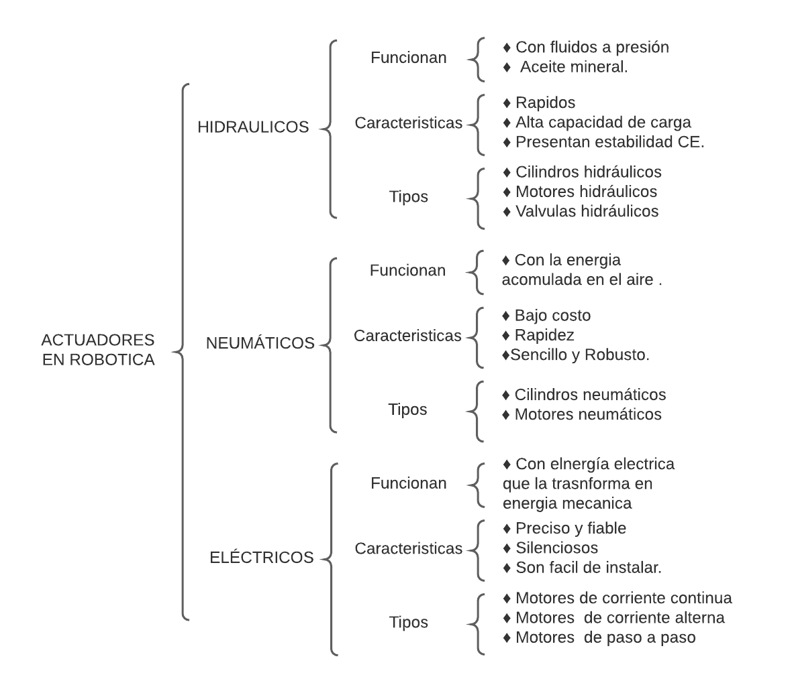
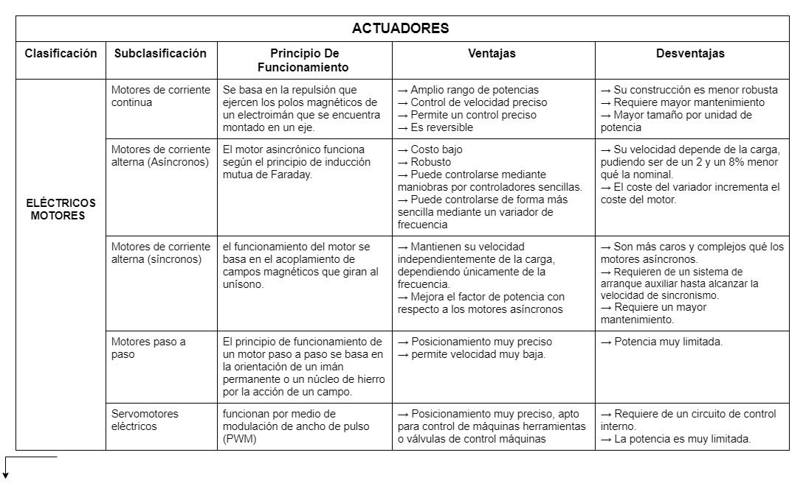
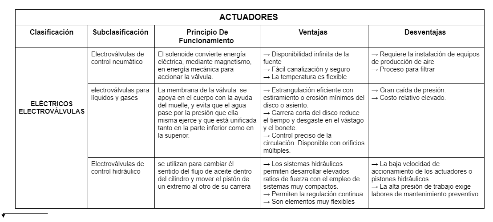
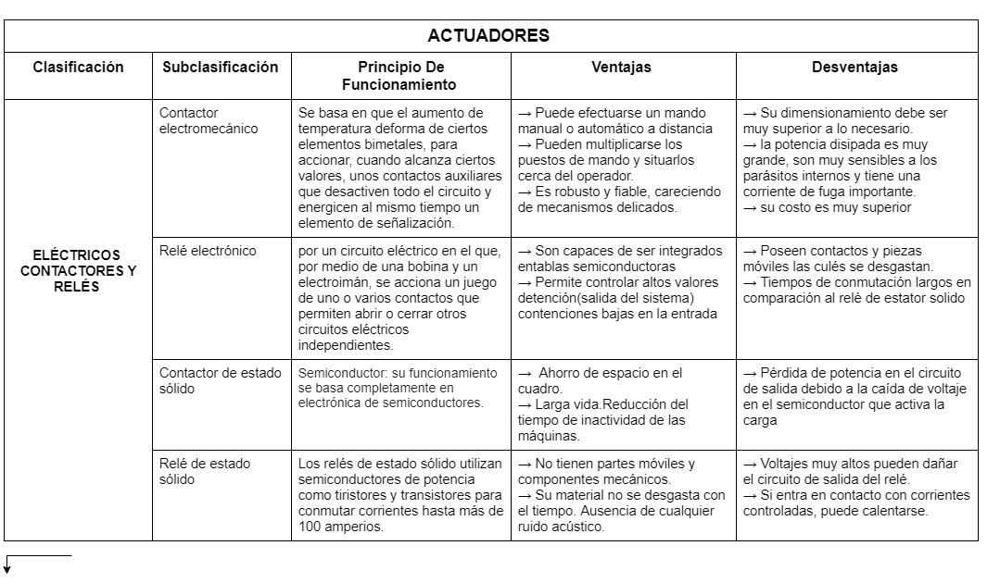
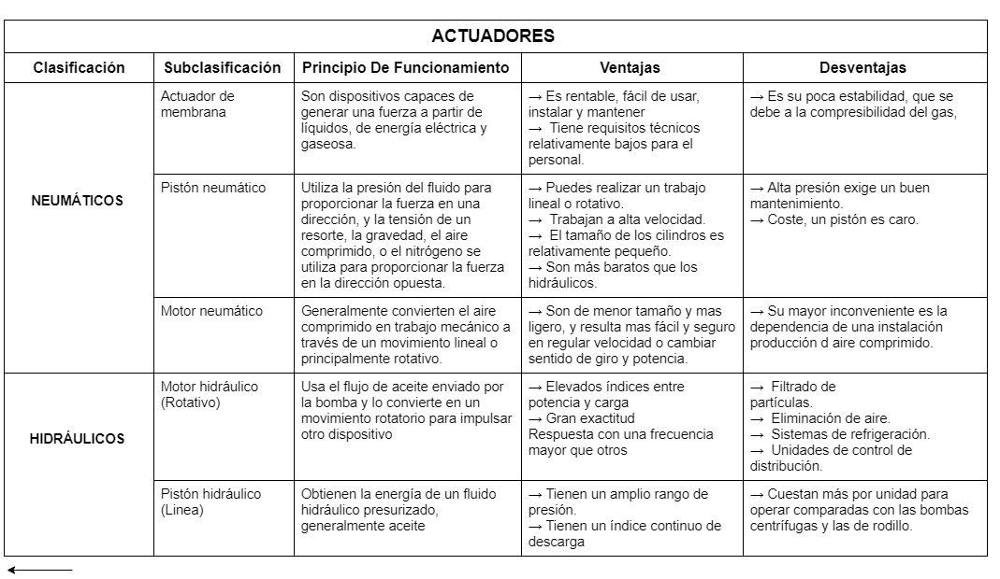

# Actuadores

## :trophy: C2.1 Reto en clase

**Actuadores Neumatico e Hidraulicos, y sus tipos**

### :blue_book: Instrucciones

- De acuerdo con la información presentada por el asesor referente al tema actuadores y a los videos observados sobre el mismo tema, elabore lo que se solicita dentro del apartado desarrollo.
- Toda actividad o reto se deberá realizar utilizando el estilo **MarkDown con extension .md** y el entorno de desarrollo VSCode, debiendo ser elaborado como un documento **single page**, es decir si el documento cuanta con imágenes, enlaces o cualquier documento externo debe ser accedido desde etiquetas y enlaces.
- Es requisito que el archivo .md contenga una etiqueta del enlace al repositorio de su documento en Github, por ejemplo **Enlace a mi GitHub**
- Al concluir el reto el reto se deberá subir a github el archivo .md creado.
- Desde el archivo **.md** se debe exportar un archivo **.pdf** con la nomenclatura **C2.1_NombreAlumno_Equipo.pdf**, el cual deberá subirse a classroom dentro de su apartado correspondiente, para que sirva como evidencia de su entrega; siendo esta plataforma **oficial** aquí se recibirá la calificación de su actividad por individual.
- Considerando que el archivo .pdf, fue obtenido desde archivo .md, ambos deben ser idénticos y mostrar el mismo contenido.
- Su repositorio ademas de que debe contar con un archivo **readme**.md dentro de su directorio raíz, con la información como datos del estudiante, equipo de trabajo, materia, carrera, datos del asesor, e incluso logotipo o imágenes, debe tener un apartado de contenidos o indice, los cuales realmente son ligas o **enlaces a sus documentos .md**, _evite utilizar texto_ para indicar enlaces internos o externo.
- Se propone una estructura tal como esta indicada abajo, sin embargo puede utilizarse cualquier otra que le apoye para organizar su repositorio.  
``` 
| readme.md
| | blog
| | | C2.1_x.md
| | | C2.2_x.md
| | | C2.3_x.md
| | img
| | docs
| | | A2.1_x.md
| | | A2.2_x.md
```

### :pencil2: Desarrollo

Listado de preguntas:

1. Basándose en el video [actuadores en Robótica](https://www.youtube.com/watch?v=e_6rjEGWqoY), realice un cuadro sinóptico sobre la clasificación de los actuadores.



2. De acuerdo con el video [descripcion de los actuadores industriales](https://www.youtube.com/watch?v=mFsPxpFHajM) realice una matriz comparativa indicando clasificacion, subclasificacion, principio de funcionamiento, ventajas y desventajas.







3. De acuerdo con el video [Neumática Industrial](https://www.youtube.com/watch?v=Wee85cI6wwQ&t=394s), explique como trabaja un sistema Neumático?

    Como funciona Inicio: El compresor genera la energía que alimenta el sistema en forma de aire comprimido, para generar aire comprimido el compresor aspira aire de su entorno y lo presuriza, creando la energía necesaria para el sistema.

    Una vez comprimido el aire necesita estar seco, para que las partículas dañinas no oxiden las partes móviles, una vez hecho esto el aire viaja por un tubo al siguiente componente el separador de líquidos y preparación de aire (FRL), cuando llega a este paso el separador hace girar el aire para eliminar la humedad, esto es posible gracias a la fuerza centrífuga.

    luego pasa al siguiente filtro para eliminar mejor la humedad gracias a los filtros para atrapar a los contaminantes no deseados, cuando la presión de aire sale del compresor, hace que la presión baja genera menos fuerza para modificar y ajustar un punto de presión deseado, podemos hacerlo desde la perrilla, cuando el aire comprimido está limpio y seco y establecido en la presión correcta para la aplicación, debemos dirigirlo para donde queremos generar movimiento, se usa una válvula de control direccional, ya que puede conecta con unas vías interna que puede conectar el aire que llega al puerto de entrada, dependiendo de la posición del movimiento móvil, para eso se cambian los carretes y esto hace que pueda el aire se dirija por el camino que se desee.
    
    Un PLC se encarga de dar la orden a la válvula para cambiarla mediante una señal eléctrica, luego hace que se genere un campo magnético que hace que una rendija se mueva y quita el bloqueo, y deja pasar el aire, dejando el carrete en su posición inicial, y así el PLC podrá dirigir el aire como lo vea necesario.
    
    Ahora el aire llega al actuador que se encarga de convertir el aire comprimido en movimiento, utilizando la energía del aire comprimido, cuando el aire comprimido entra hace que el pistón se mueva hacia delante, como el pistón está unido a un vástago que se extenderá por la fuerza generada del aire comprimido, para que el actuador regrese a si posición anterior, entonces con ayuda del la   de control direccional cambiando el como fluye el aire, respecto al puesto de trabajos , cuando el aire comprimido empuja el lado opuesto, expulsa el aire comprimido que estaba de otro lado , a estos se le llama retroacción, el aire que se regresa se llama aire de escape.  Este proceso se puede repetir cuantas veces el PLC indiqué.
 

### :bomb: Rubrica

| Criterios     | Descripción                                                                                  | Puntaje |
| ------------- | -------------------------------------------------------------------------------------------- | ------- |
| Instrucciones | Se cumple con cada uno de los puntos indicados dentro del apartado Instrucciones?            | 20 |
| Desarrollo    | Se respondió a cada uno de los puntos solicitados dentro del desarrollo de la actividad?     | 80      |

:house: :open_file_folder: [ENLACE - MI GITHUB](https://github.com/Villalobos39/SISTEMAS-PROGRAMABLES.git )