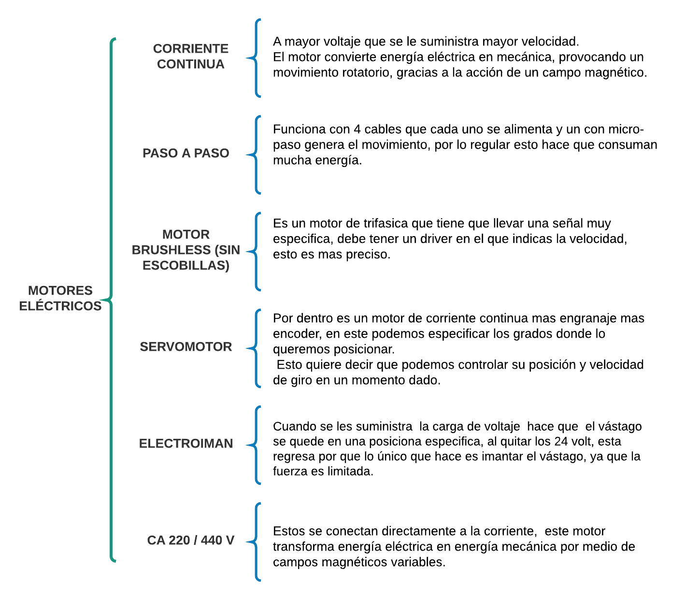

# Actuadores

## :trophy: C2.2 Actuadores eléctricos

**Actuadores eléctricos y sus tipos**

### :blue_book: Instrucciones

- De acuerdo con la información presentada por el asesor referente al tema actuadores y a los videos observados sobre el mismo tema, elabore lo que se solicita dentro del apartado desarrollo.
- Toda actividad o reto se deberá realizar utilizando el estilo **MarkDown con extension .md** y el entorno de desarrollo VSCode, debiendo ser elaborado como un documento **single page**, es decir si el documento cuanta con imágenes, enlaces o cualquier documento externo debe ser accedido desde etiquetas y enlaces.
- Es requisito que el archivo .md contenga una etiqueta del enlace al repositorio de su documento en Github, por ejemplo **Enlace a mi GitHub**
- Al concluir el reto el reto se deberá subir a github el archivo .md creado.
- Desde el archivo **.md** se debe exportar un archivo **.pdf** con la nomenclatura **C2.2_NombreAlumno_Equipo.pdf**, el cual deberá subirse a classroom dentro de su apartado correspondiente, para que sirva como evidencia de su entrega; siendo esta plataforma **oficial** aquí se recibirá la calificación de su actividad por individual.
- Considerando que el archivo .pdf, fue obtenido desde archivo .md, ambos deben ser idénticos y mostrar el mismo contenido.
- Su repositorio ademas de que debe contar con un archivo **readme**.md dentro de su directorio raíz, con la información como datos del estudiante, equipo de trabajo, materia, carrera, datos del asesor, e incluso logotipo o imágenes, debe tener un apartado de contenidos o indice, los cuales realmente son ligas o **enlaces a sus documentos .md**, _evite utilizar texto_ para indicar enlaces internos o externo.
- Se propone una estructura tal como esta indicada abajo, sin embargo puede utilizarse cualquier otra que le apoye para organizar su repositorio.  
``` 
| readme.md
| | blog
| | | C2.1_x.md
| | | C2.2_x.md
| | | C2.3_x.md
| | img
| | docs
| | | A2.1_x.md
| | | A2.2_x.md
```


## :pencil2: Desarrollo


Listado de preguntas:

1. Basado en el video [tipos de motores eléctricos](https://www.youtube.com/watch?v=pgr4yRMnB_A) elabore un cuadro sinoptico indicando su clasificación, y principio de func


2. De acuerdo con el video [instalación básica de neumática y arduino](https://www.youtube.com/watch?v=DdvLAXfuNpY&t=8s), cual es el propósito del microcontrolador para este sistema? Que otros componentes electrónicos observa en el video?

    Pues vemos que el Arduino se programa las salidas a 5 volteos, conectamos la salida de 5 volteos de los pines digitales al la tira de relés, una vez de tener el Arduino listo este se encarga de conectar a los relés y transmite esos 5 volteos, convirtiendo así en una salida de 24 V,  por que se necesitan 24 volteos para controlar las electroválvulas, gracias a esto el aire comprimido de la toma de aire hace que se dirija por medios de los conductos al actuador neumático. 

    Componentes que se observan son:
        La toma de aire comprimido, el Arduino, la electroválvula, tira de relés, los actuadores como el cilindro de doble efecto, el rollo de pinzas y el sencillo el pistón. 


3. Basandose en el video [Como funciona la impresora 3D](https://www.youtube.com/watch?v=C4HAJ5HLuB4), que tipo de sensores y actuadores están integrados, y con que proposito es utilizado dentro de este sistema de impresión? 

    Funciona con 3 ejes principales, que son movidos por unos pequeños motores, que a su vez son controlados por la electrónica de la impresora. 
    La zona de extrusor   compuesta por un pequeño ventilador y un disipador de calor qué va unido al motor. 

    Tipo de sensores y actuadores están integrados  
        El sensor térmico qué es usado para identificar qué el filamento qué se introdujo por el  extractor  para qué se derrita.
        Los motores de paso a paso podrían ser muy útiles ya qué son más precisos, al igual qué el servomotor qué puede señalar la posición de este.
        Para tener una mayor calidad de la figura es recomendable usar una velocidad baja. También otro tipo sería el de distancia para saber y tomar en cuenta las distancia en la qué se coloca el material. 


### :bomb: Rubrica

| Criterios     | Descripción                                                                                  | Puntaje |
| ------------- | -------------------------------------------------------------------------------------------- | ------- |
| Instrucciones | Se cumple con cada uno de los puntos indicados dentro del apartado Instrucciones?            | 20 |
| Desarrollo    | Se respondió a cada uno de los puntos solicitados dentro del desarrollo de la actividad?     | 80      |

:house: :open_file_folder: [ENLACE - MI GITHUB](https://github.com/Villalobos39/SISTEMAS-PROGRAMABLES.git)