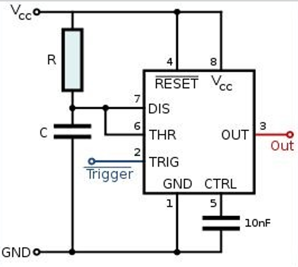

# Actuadores

## :trophy: C2.3 Reto en clase

**Circuito temporizador con circuito NE555**

### :blue_book: Instrucciones

- De acuerdo con la información presentada por el asesor referente al tema, elabore lo que se solicita dentro del apartado desarrollo.
- Toda actividad o reto se deberá realizar utilizando el estilo **MarkDown con extension .md** y el entorno de desarrollo VSCode, debiendo ser elaborado como un documento **single page**, es decir si el documento cuanta con imágenes, enlaces o cualquier documento externo debe ser accedido desde etiquetas y enlaces.
- Es requisito que el archivo .md contenga una etiqueta del enlace al repositorio de su documento en Github, por ejemplo **Enlace a mi GitHub**
- Al concluir el reto el reto se deberá subir a github el archivo .md creado.
- Desde el archivo **.md** se debe exportar un archivo **.pdf** con la nomenclatura **C2.3_NombreAlumno_Equipo.pdf**, el cual deberá subirse a classroom dentro de su apartado correspondiente, para que sirva como evidencia de su entrega; siendo esta plataforma **oficial** aquí se recibirá la calificación de su actividad por individual.
- Considerando que el archivo .pdf, fue obtenido desde archivo .md, ambos deben ser idénticos y mostrar el mismo contenido.
- Su repositorio ademas de que debe contar con un archivo **readme**.md dentro de su directorio raíz, con la información como datos del estudiante, equipo de trabajo, materia, carrera, datos del asesor, e incluso logotipo o imágenes, debe tener un apartado de contenidos o indice, los cuales realmente son ligas o **enlaces a sus documentos .md**, _evite utilizar texto_ para indicar enlaces internos o externo.
- Se propone una estructura tal como esta indicada abajo, sin embargo puede utilizarse cualquier otra que le apoye para organizar su repositorio.  
``` 
| readme.md
| | blog
| | | C2.1_x.md
| | | C2.2_x.md
| | | C2.3_x.md
| | img
| | docs
| | | A2.1_x.md
| | | A2.2_x.md
```

## :pencil2: Desarrollo

1. Investigue que es la modulación por ancho de pulso y para que sirve.

    Es una técnica utilizada para regular la velocidad de giro de los motores eléctricos de inducción o asíncronos. Mantiene el par motor constante y no supone un desaprovechamiento de la energía eléctrica.

    La modulación de ancho de pulso está formada por una señal de onda cuadrada que no siempre tiene la misma relación entre el tiempo que está en alto y el tiempo que está en bajo. 

    El tiempo que la señal se encuentra en nivel alto se denomina tiempo on(Ton), mientras que el tiempo del nivel bajo se le llama tiempo off (Toff).


2. Calcule el valor de C y R para obtener un valor de señal de 5 segundos para el siguiente circuito temporizador mono-estable.
   
     Valor R | Valor C |
    ---------|----------|
    12 Ohms   | 378 mF |

    Ct = 1.1 * R * C

    Sabemos que el resultado esperado es de 5 seg, para ello sustituimos en la fórmula: 
    
        Ct= 5 seg 
        5 seg= 1.1 * R * C
        5 Seg/ 1.1 = R * C
        4.54 = R * C
    Aquí podemos asignar un valor a R o C, yo se lo asigné a R con un valor de la resistencia comercial de 12 Ohms. 
       
        C = 4.54 / R
        C = 4.54 / 12 
        C = 0.3787 F
  
    Para comprobar sustituimos los valores en la fórmula original: 

        Ct = 1.1 * (12 Ohms) * (0.3787 F)
        Ct = 4.998 Seg

    Los valores son: 
    - R  = 12 Ohms 
    - C  = 378 mF
    - Ct = 4.99 Seg

3. Como se podrá observar la imagen anexa corresponde a un circuito temporizador: 
   
   ¿Que terminal se tendría que utilizar para activar el temporizador? 
        
        El disparo (Trigger) es la terminal 2.

   ¿Cual terminal se utilizaría si se desea integrar un actuador eléctrico?
    
        El output, la terminal 3. 


  
<p align="center">
    
</p>


### :bomb: Rubrica

| Criterios     | Descripción                                                                                  | Puntaje |
| ------------- | -------------------------------------------------------------------------------------------- | ------- |
| Instrucciones | Se cumple con cada uno de los puntos indicados dentro del apartado Instrucciones?            | 20 |
| Desarrollo    | Se respondió a cada uno de los puntos solicitados dentro del desarrollo de la actividad?     | 80      |

:house: :open_file_folder: [ENLACE - MI GITHUB](https://github.com/Villalobos39/SISTEMAS-PROGRAMABLES.git)