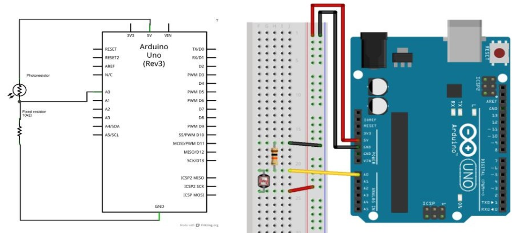
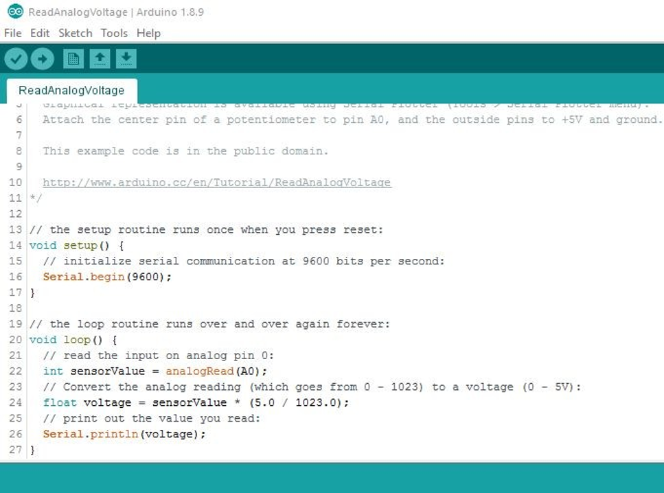
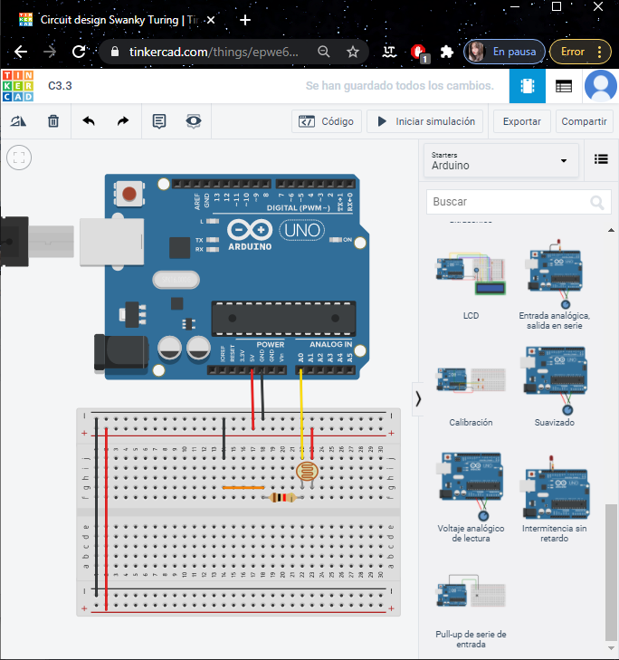
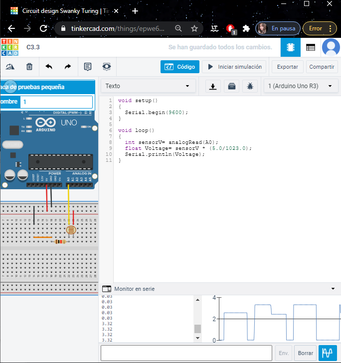

# Programación Microcontrolador Arduino

## :trophy: C3.3 Entradas Análoga

Arduino y entrada análoga, utilizando una resistencia y un sensor LDR

## :blue_book: Instrucciones

- De acuerdo con la información presentada por el asesor referente al tema, desarrollar lo que se indica dentro del apartado siguiente.
- Toda actividad o reto se deberá realizar utilizando el estilo **MarkDown con extension .md** y el entorno de desarrollo VSCode, debiendo ser elaborado como un documento **single page**, es decir si el documento cuanta con imágenes, enlaces o cualquier documento externo debe ser accedido desde etiquetas y enlaces.
- Es requisito que el archivo .md contenga una etiqueta del enlace al repositorio de su documento en Github, por ejemplo **Enlace a mi GitHub**
- Al concluir el reto el reto se deberá subir a github el archivo .md creado.
- Desde el archivo **.md** se debe exportar un archivo **.pdf** con la nomenclatura **C3.3_NombreAlumno_Equipo.pdf**, el cual deberá subirse a classroom dentro de su apartado correspondiente, para que sirva como evidencia de su entrega; siendo esta plataforma **oficial** aquí se recibirá la calificación de su actividad por individual.
- Considerando que el archivo .pdf, fue obtenido desde archivo .md, ambos deben ser idénticos y mostrar el mismo contenido.
- Su repositorio ademas de que debe contar con un archivo **readme**.md dentro de su directorio raíz, con la información como datos del estudiante, equipo de trabajo, materia, carrera, datos del asesor, e incluso logotipo o imágenes, debe tener un apartado de contenidos o indice, los cuales realmente son ligas o **enlaces a sus documentos .md**, _evite utilizar texto_ para indicar enlaces internos o externo.
- Se propone una estructura tal como esta indicada abajo, sin embargo puede utilizarse cualquier otra que le apoye para organizar su repositorio.  

``` 
| readme.md
| | blog
| | | C3.1_TituloActividad.md
| | | C3.2_TituloActividad.md
| | | C3.3_TituloActividad.md
| | img
| | docs
| | | A3.1_TituloActividad.md
| | | A3.2_TituloActividad.md
```

## :pencil2: Desarrollo

1. Basado en el siguiente circuito, y utilizando uno de los simuladores propuestos, ensamblar lo que observa.


<p align="center">
    
</p>

2. Analice y escriba el programa que se muestra a continuación.

<p align="center">
    
</p>
Explicacion del codigo: 

   - Comienza con el SETUP, que como sabemos es el que inicializa las funciones de los modos de trabajo de los pines, dentro de ella vemos la instrucción de Serial.Begin, que abre el puerto serie y fija la velocidad.
   - Luego tenemos al LOOP que ejecuta las instrucciones que tiene dentro de forma cíclica.
   - Dentro de este bloque se declararon las variables para el valor del sensor, le la entrada del pin A0, luego se declara a otra variable tipo flota, para la operación donde se convierte la lectura analógica que va de 0 a 1023 para un voltaje de 0 a 5V, esto se obtiene multiplicando el valor de del sensor con el resultado de la división de 5 entre 1023.
   - Finalmente se imprime el resultado con la función SERIAL.println.

Explicacion de lo que Observo que pasa:
  -  Antes de comenzar la simulación primero vemos que estamos haciendo uso de fotorresistencia, y con ayuda de este podremos ver la señal qué sale, ya qué sale el voltaje desde el pin de 5 vol así qué puede variar, con una operación se multiplica el valor sensor por la división de 5 entre 1023, y asi obtenemos el valor del votaje y este resultado se ve en el monitor.


1. Inserte aquí las imágenes que considere como evidencias para demostrar el resultado obtenido.





### :bomb: Rubrica

| Criterios     | Descripción                                                                                  | Puntaje |
| ------------- | -------------------------------------------------------------------------------------------- | ------- |
| Instrucciones | Se cumple con cada uno de los puntos indicados dentro del apartado Instrucciones?            | 20 |
| Desarrollo    | Se respondió a cada uno de los puntos solicitados dentro del desarrollo de la actividad?     | 80      |


:house: :open_file_folder: [ENLACE - MI GITHUB](https://github.com/Villalobos39/SISTEMAS-PROGRAMABLES.git)