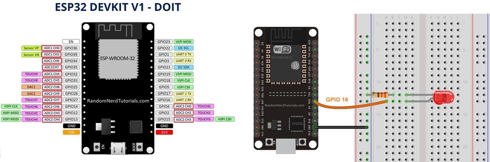
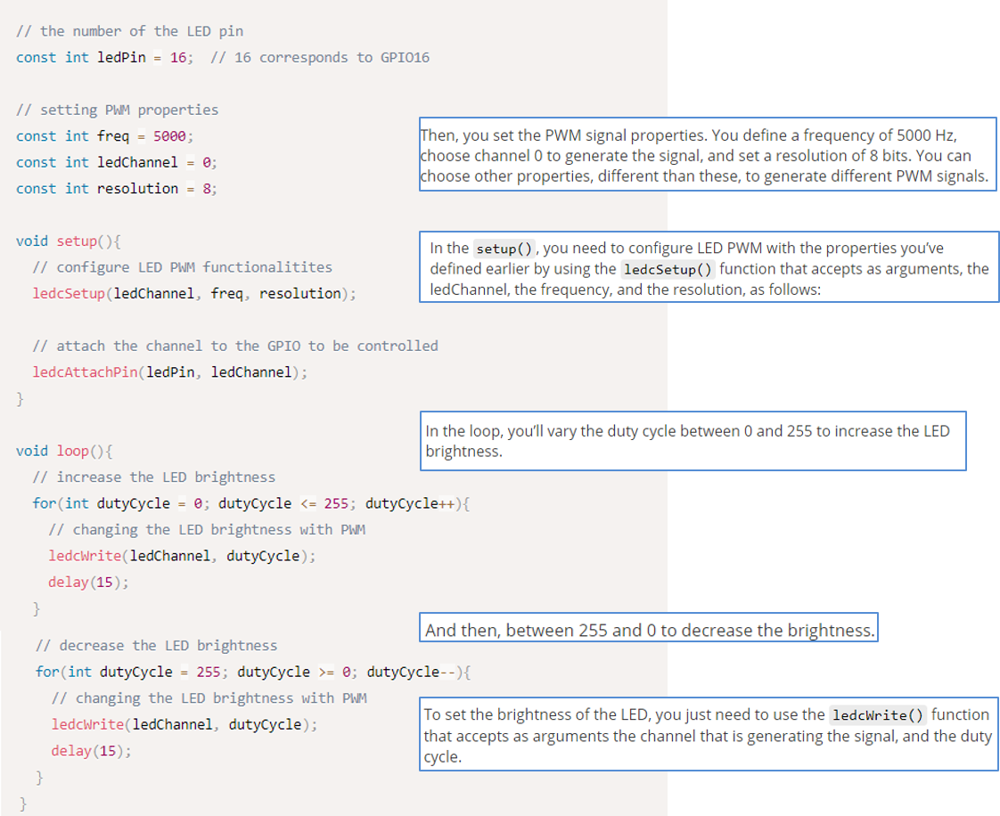
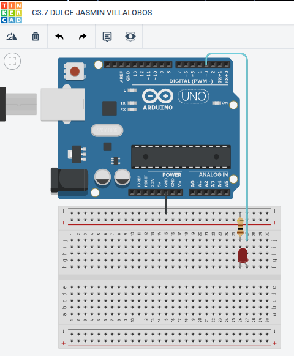
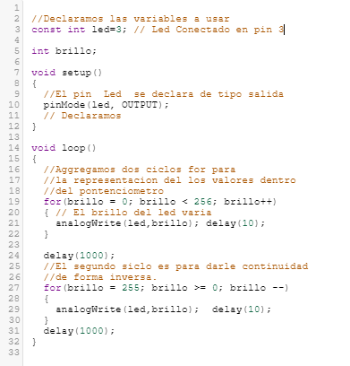
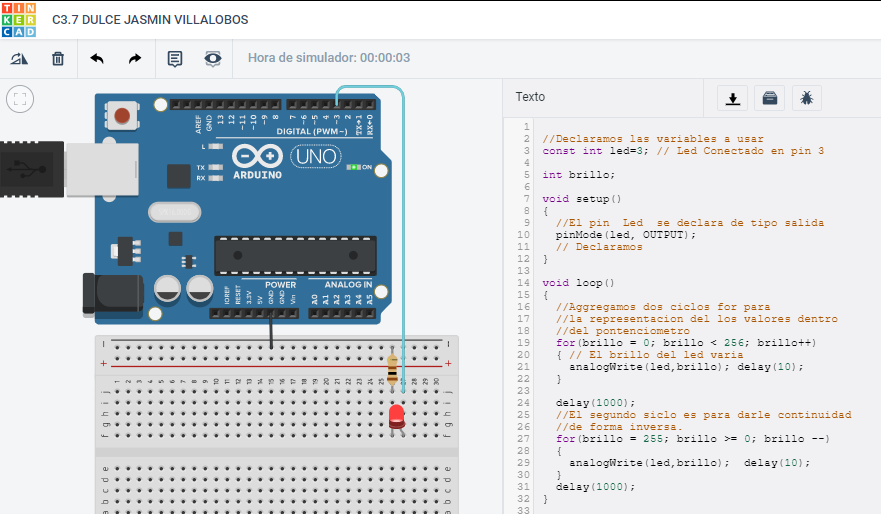
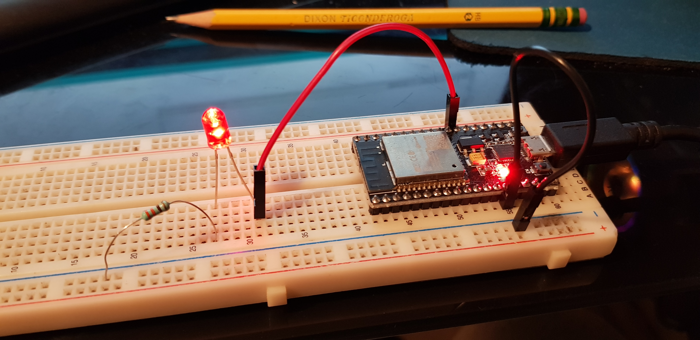
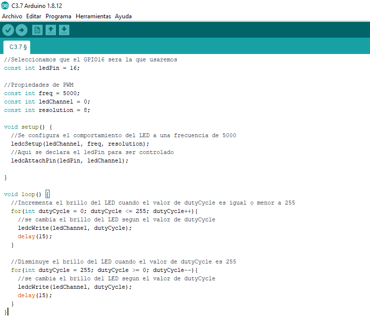

# :trophy: C3.7 Programación Microcontrolador NodeMCU ESP32

Arduino y modulador de ancho de pulso PWM con salida analógica

___

## :blue_book: Instrucciones

- De acuerdo con la información presentada por el asesor referente al tema, desarrollar lo que se indica dentro del apartado siguiente.
- Toda actividad o reto se deberá realizar utilizando el estilo **MarkDown con extension .md** y el entorno de desarrollo VSCode, debiendo ser elaborado como un documento **single page**, es decir si el documento cuanta con imágenes, enlaces o cualquier documento externo debe ser accedido desde etiquetas y enlaces.
- Es requisito que el archivo .md contenga una etiqueta del enlace al repositorio de su documento en Github, por ejemplo **Enlace a mi GitHub**
- Al concluir el reto el reto se deberá subir a github el archivo .md creado.
- Desde el archivo **.md** se debe exportar un archivo **.pdf** con la nomenclatura **C3.7_NombreAlumno_Equipo.pdf**, el cual deberá subirse a classroom dentro de su apartado correspondiente, para que sirva como evidencia de su entrega; siendo esta plataforma **oficial** aquí se recibirá la calificación de su actividad por individual.
- Considerando que el archivo .pdf, fue obtenido desde archivo .md, ambos deben ser idénticos y mostrar el mismo contenido.
- Su repositorio ademas de que debe contar con un archivo **readme**.md dentro de su directorio raíz, con la información como datos del estudiante, equipo de trabajo, materia, carrera, datos del asesor, e incluso logotipo o imágenes, debe tener un apartado de contenidos o indice, los cuales realmente son ligas o **enlaces a sus documentos .md**, _evite utilizar texto_ para indicar enlaces internos o externo.
- Se propone una estructura tal como esta indicada abajo, sin embargo puede utilizarse cualquier otra que le apoye para organizar su repositorio.  


``` 
| readme.md
| | blog
| | | C3.1_TituloActividad.md
| | | C3.2_TituloActividad.md
| | | C3.3_TituloActividad.md
| | | C3.4_TituloActividad.md
| | | C3.5_TituloActividad.md
| | | C3.6_TituloActividad.md
| | | C3.7_TituloActividad.md
| | | C3.8_TituloActividad.md
| | img
| | docs
| | | A3.1_TituloActividad.md
| | | A3.2_TituloActividad.md
```

___

## :pencil2: Desarrollo

1. Ensamble el circuito mostrado en la figura siguiente.

<p align="center">
    
</p>

2. Analice y escriba el programa que se muestra a continuación.

<p align="center">
    
</p>

Fuente de consulta: [Random Nerd Tutorials](https://randomnerdtutorials.com/esp32-pwm-arduino-ide/)

3. Inserte aquí las imágenes que considere como evidencias para demostrar el resultado obtenido.

    Evidencia usando el simulador.

        Para generar señales PWM con un arduino, vi un tutorial para tomarlo como referencia y poder aplicarlo en un arduino en el simulador.




     Para la simulación, se debia encender el led al conectar solo el puerto GPI16 a una pata del Led mientras la otra con una resistenacia a Tierra GND.





        Para simular eso se pone en el codigo los dos for, como en el ejemplo, de forma que usara los valores del pontenciometro, y asi el led se fuera apagando y encendiendo. 





    Evidencia proporcionada por el compañero con los componentes: 



___

### :bomb: Rubrica

| Criterios     | Descripción                                                                                  | Puntaje |
| ------------- | -------------------------------------------------------------------------------------------- | ------- |
| Instrucciones | Se cumple con cada uno de los puntos indicados dentro del apartado Instrucciones?            | 20 |
| Desarrollo    | Se respondió a cada uno de los puntos solicitados dentro del desarrollo de la actividad?     | 80      |

:house: :open_file_folder: [ENLACE - MI GITHUB](https://github.com/Villalobos39/SISTEMAS-PROGRAMABLES.git)